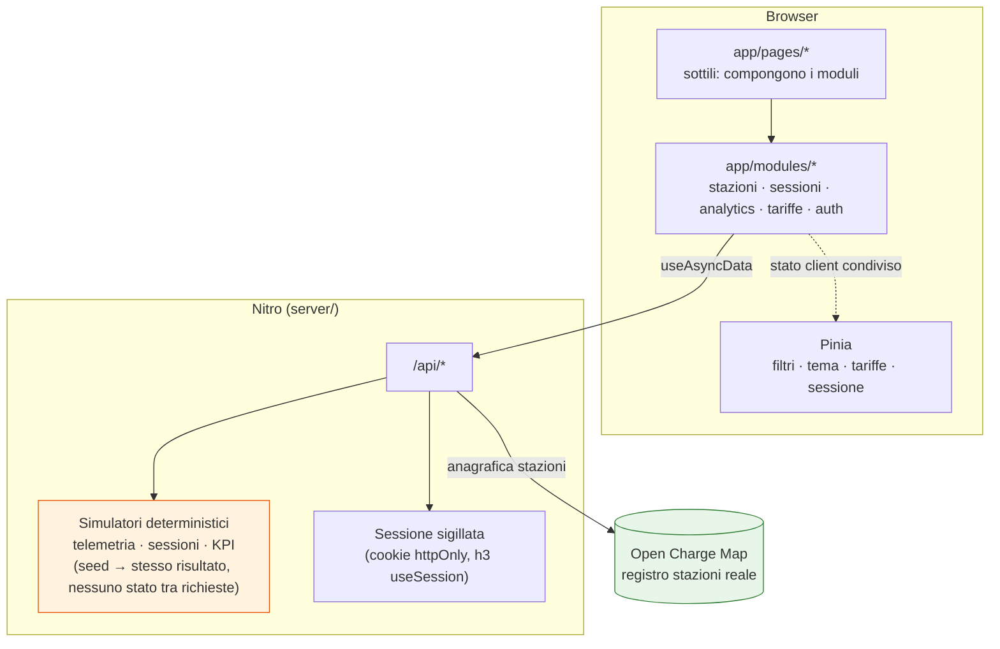

# ChargeHub

[](https://github.com/MihaelaAghirculesei/ChargeHub/actions/workflows/ci.yml)

Dashboard per la gestione di infrastruttura di ricarica elettrica. Progetto portfolio costruito con Nuxt 4 e Vuetify 3.

| Dashboard                                                    | Stazioni (mappa + lista)                                                            |
| ------------------------------------------------------------ | ----------------------------------------------------------------------------------- |
|  |  |

| Dettaglio stazione                                                             | Analytics                                                           |
| ------------------------------------------------------------------------------ | ------------------------------------------------------------------- |
|  |  |

## Stack

- **Framework:** Nuxt 4 + TypeScript strict
- **UI:** Vuetify 3 (via `vuetify-nuxt-module`) + SCSS
- **State:** Pinia — solo per stato client condiviso, non per i dati dal server (vedi [ADR-0005](docs/adr/0005-pinia-state.md))
- **Validazione:** Zod
- **Mappa:** MapLibre GL JS + OpenStreetMap
- **Grafici:** Chart.js (`vue-chartjs`)
- **Test:** Vitest + `@nuxt/test-utils` (unit/component) + Playwright (E2E, Chromium/WebKit/mobile) + axe-core (accessibilità)
- **i18n:** `@nuxtjs/i18n`, tedesco (default) + inglese, routing localizzato (`/de/...`, `/en/...`)
- **CI:** GitHub Actions — lint, typecheck, unit test con soglia di copertura, build, E2E, Lighthouse CI (vedi [`.github/workflows/ci.yml`](.github/workflows/ci.yml))

## Architettura



**Perché questa forma:** l'anagrafica delle stazioni è l'unico dato realmente esterno (OCM); tutto ciò che OCM non offre — stato di ricarica live, sessioni storiche, KPI — è simulato **lato server**, stateless per costruzione (nessuna variabile di modulo mutata, nessun `setInterval`: il target di deploy è Vercel serverless, dove un'istanza di funzione non sopravvive garantita tra un'invocazione e la successiva — vedi [ADR-0002](docs/adr/0002-telemetry-simulation.md)). Il client non sa la differenza: entrambe le fonti arrivano dietro lo stesso `/api/*`.

### Decisioni tecniche principali

| Decisione                                                                 | Perché                                                                                                                                          | ADR                                           |
| ------------------------------------------------------------------------- | ----------------------------------------------------------------------------------------------------------------------------------------------- | --------------------------------------------- |
| Simulatori deterministici (seed → stesso risultato), non stato in memoria | Vercel è serverless: niente garantisce che un'istanza sopravviva tra due richieste                                                              | [0002](docs/adr/0002-telemetry-simulation.md) |
| Aggiornamenti live via polling dietro un'interfaccia, non WebSocket       | Un'interfaccia `TelemetryTransport` disaccoppia la UI dal trasporto — passare a SSE/WebSocket un giorno tocca un solo file                      | [0003](docs/adr/0003-live-updates.md)         |
| Struttura feature-first (`app/modules/`), non per tipo di file            | Con 6 aree funzionali, una cartella per modulo si legge da sola; una struttura per tipo si perde tra prefissi di nome                           | [0004](docs/adr/0004-modular-structure.md)    |
| Pinia solo per stato client, mai per dati dal server                      | `useAsyncData` già gestisce cache/SSR/dedup — duplicarlo in uno store crea due fonti di verità                                                  | [0005](docs/adr/0005-pinia-state.md)          |
| Rendering ibrido per rotta (prerender/SSR/client-side)                    | Login statico, dashboard dinamica, dettaglio stazione SSR — un default unico avrebbe sacrificato uno dei tre                                    | [0006](docs/adr/0006-rendering-strategy.md)   |
| Design system con ruoli semantici (mai colore da solo)                    | Stato di uno stallo di ricarica comunicato da icona + testo + colore insieme, non dal colore isolato — requisito di accessibilità, non estetica | [0001](docs/adr/0001-design-system.md)        |

## Dati: cosa è reale, cosa è simulato

Dichiarato apertamente, non nascosto in un commento:

- **Anagrafica stazioni** (nome, indirizzo, connettori, operatore): **reale**, da [Open Charge Map](https://openchargemap.org/) — un registro aggiornato da chi censisce le stazioni, non un feed live.
- **Stato di ricarica, potenza istantanea, sessioni storiche, KPI**: **simulati** lato server, deterministici (stesso seed → stesso risultato), perché OCM non espone nulla di questo e nessun feed reale del genere è accessibile senza hardware o un accordo con un CPO.
- **Login**: **mock esplicito**, due account fissi hardcoded lato server (vedi sotto) — non c'è un database utenti, solo per dimostrare guardie di rotta e permessi per ruolo.

## Setup

```bash
pnpm install
cp .env.example .env   # imposta NUXT_OCM_API_KEY, vedi sotto
pnpm dev
```

L'app valida la configurazione al boot: senza una `NUXT_OCM_API_KEY` valida in `.env`, il server si arresta con un errore esplicito invece di partire in uno stato inconsistente. La chiave si ottiene registrandosi su [openchargemap.org/site/develop/api](https://openchargemap.org/site/develop/api).

Serve anche una `NUXT_SESSION_PASSWORD` (almeno 32 caratteri) per il login — genera la tua, es. `node -e "console.log(require('crypto').randomBytes(32).toString('hex'))"`.

## Login

**Mock esplicito: nessun backend/database reale.** Due account fissi, hardcoded lato server (`server/utils/auth-session.ts`) solo per dimostrare guardie di rotta e permessi (Giorno 16) — non è pensato per la produzione.

| Utente     | Password      | Ruolo      | Può                                |
| ---------- | ------------- | ---------- | ---------------------------------- |
| `operator` | `operator123` | `operator` | Gestire le tariffe (`/tariffs`)    |
| `viewer`   | `viewer123`   | `viewer`   | Vedere le tariffe, non modificarle |

La sessione è un cookie httpOnly sigillato (firmato + cifrato con `NUXT_SESSION_PASSWORD`, via `useSession` di h3) — nessuno store server-side, coerente con il deploy serverless (stesso principio del simulatore di telemetria, [ADR-0002](docs/adr/0002-telemetry-simulation.md)).

## Script

| Comando                                                | Descrizione                                       |
| ------------------------------------------------------ | ------------------------------------------------- |
| `pnpm dev`                                             | Dev server                                        |
| `pnpm build`                                           | Build di produzione                               |
| `pnpm lint` / `pnpm lint:fix`                          | ESLint                                            |
| `pnpm format` / `pnpm format:check`                    | Prettier                                          |
| `pnpm typecheck`                                       | Type check TypeScript strict                      |
| `pnpm test` / `pnpm test:watch` / `pnpm test:coverage` | Vitest (unit/component), con gate di copertura    |
| `pnpm test:e2e`                                        | Playwright — Chromium, WebKit, Pixel 7, iPhone 14 |

## Limiti noti e cosa farei con più tempo

- **Icone via webfont, non SVG on-demand.** `@mdi/font` locale (non più da CDN esterna, vedi ADR e log del Giorno 21) resta comunque l'intero set di icone scaricato, non solo quelle usate. La migrazione a icone SVG tree-shaken (`@mdi/js`) richiede riscrivere ogni riferimento `icon="mdi-xxx"` nel codice — decine di punti, rimandata per rischio/tempo, non per svista.
- **Nessun caching HTTP applicativo (`swr`/ISR) sul dettaglio stazione.** Un tentativo reale è stato fatto e respinto perché rompeva l'idratazione client in questa combinazione Nuxt/Nitro (vedi [ADR-0006](docs/adr/0006-rendering-strategy.md)) — ogni richiesta rifà il fetch verso OCM. Da riprendere se la versione di Nuxt/Nitro cambia comportamento.
- **Zero test di un click preciso su un marker della mappa.** MapLibre renderizza su canvas/WebGL: le coordinate pixel di una stazione dipendono dalla sua proiezione cartografica, che ricalcolare in un test duplicherebbe la logica della libreria solo per un test fragile a ogni cambio di viewport/zoom di default. La sincronia mappa↔lista è verificata nella direzione stabile (hover riga tabella → evidenziazione), non nell'altra.
- **CI E2E/Lighthouse dipendono da un secret non incluso nel repository.** `NUXT_OCM_API_KEY` va aggiunta come secret di GitHub Actions perché quei job chiamino davvero OpenChargeMap — senza, falliscono con un 502 dalla chiave finta usata come placeholder, comportamento atteso e documentato, non un bug del workflow.
- **Nessun deploy Vercel reale collegato.** Il progetto è pronto per il deploy (route rules, build, env validate) ma non è mai stato effettivamente pubblicato — una scelta deliberata, non un passo dimenticato.
- **Con più tempo:** subsetting/SVG delle icone per il bundle iniziale; badge di coverage/Lighthouse nel README (richiedono un servizio esterno tipo Codecov o artefatti committati, entrambi fuori ambito finora); un secondo linguaggio di dati simulati (es. prezzi dinamici per fascia oraria) per rendere il calcolatore tariffe più realistico.

## Stato del progetto

Le decisioni architetturali sono documentate come ADR in [`docs/adr/`](docs/adr/) man mano che vengono prese. Il log di avanzamento giorno per giorno (non incluso nel repository) copre l'intero percorso dal setup iniziale a CI/CD.
