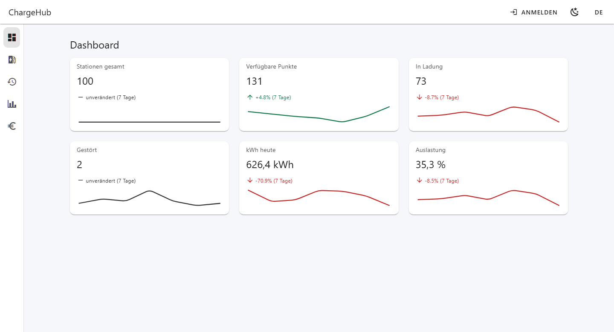
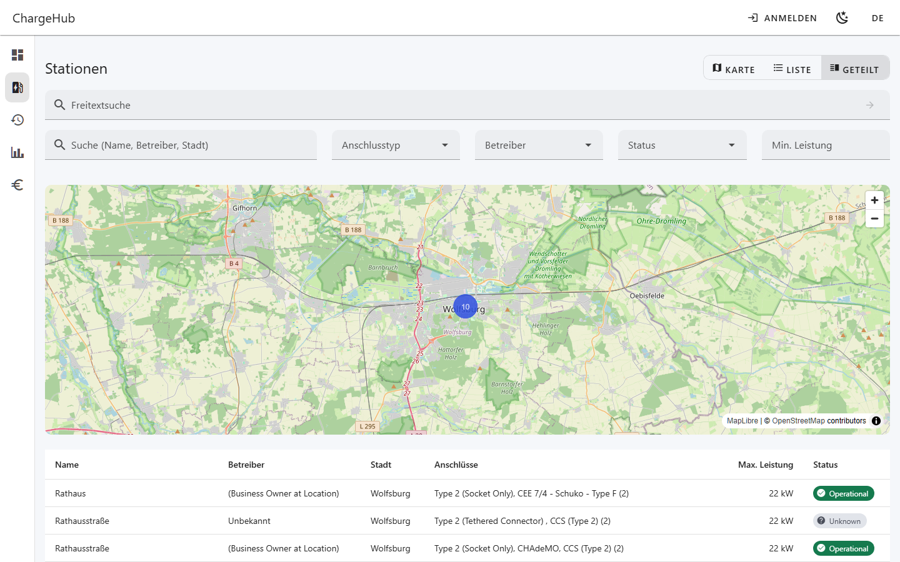
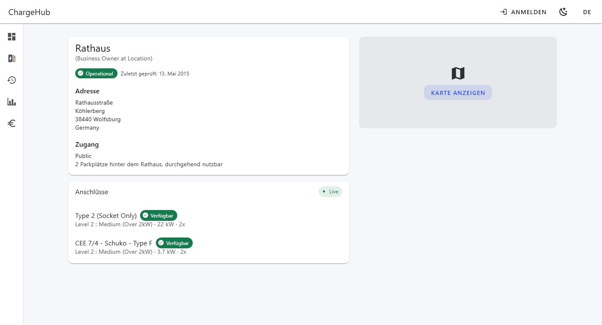
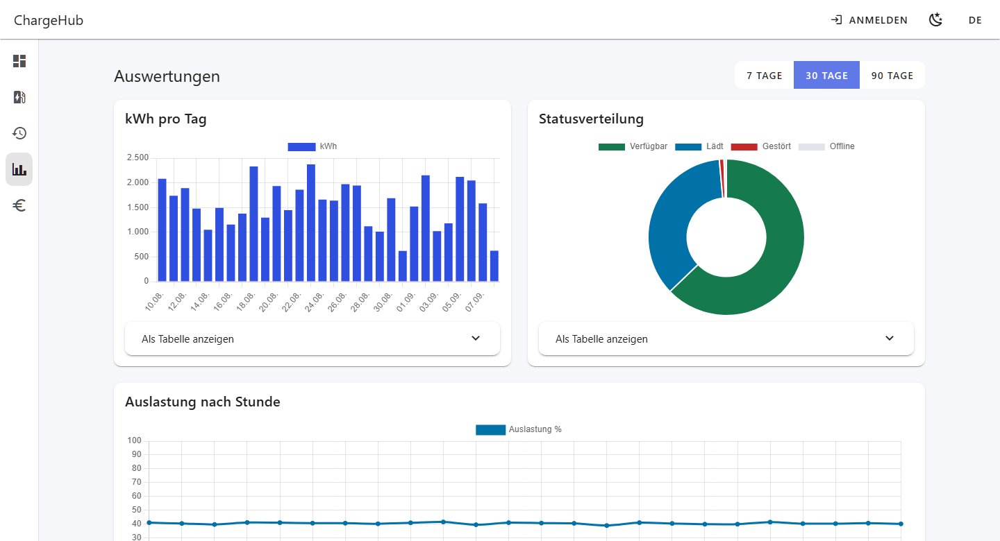
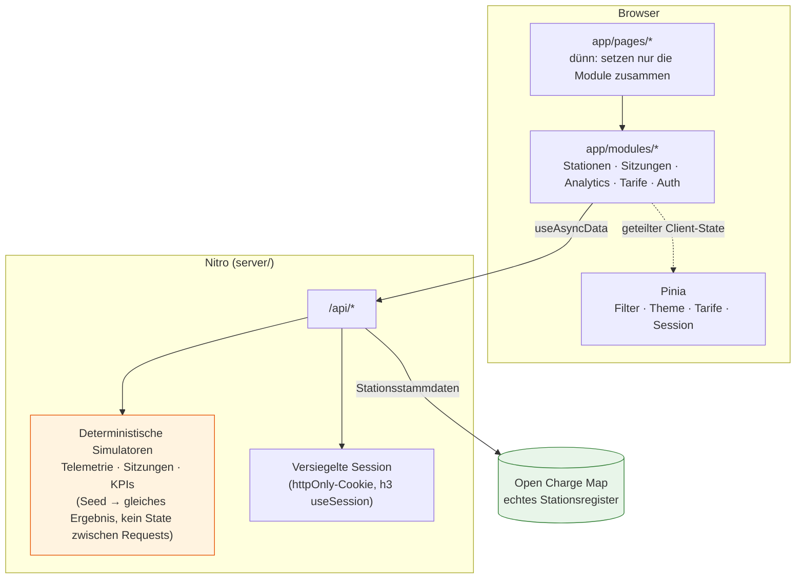

# ChargeHub

[](https://github.com/MihaelaAghirculesei/ChargeHub/actions/workflows/ci.yml)

Dashboard zur Verwaltung von Ladeinfrastruktur für Elektrofahrzeuge. Portfolio-Projekt, gebaut mit Nuxt 4 und Vuetify 3.

**Live-Demo:** [charge-hub-one.vercel.app/de](https://charge-hub-one.vercel.app/de) — Zugangsdaten siehe [Login](#login) unten.

| Dashboard                                                        | Stationen (Karte + Liste)                                                              |
| ---------------------------------------------------------------- | -------------------------------------------------------------------------------------- |
|  |  |

| Stationsdetail                                                             | Analytics                                                                 |
| -------------------------------------------------------------------------- | ------------------------------------------------------------------------- |
|  |  |

## Stack

- **Framework:** Nuxt 4 + TypeScript strict
- **UI:** Vuetify 3 (über `vuetify-nuxt-module`) + SCSS
- **State:** Pinia — nur für geteilten Client-State, nicht für Server-Daten (siehe [ADR-0005](docs/adr/0005-pinia-state.md))
- **Validierung:** Zod
- **Karte:** MapLibre GL JS + OpenStreetMap
- **Diagramme:** Chart.js (`vue-chartjs`)
- **Freitextsuche:** Claude Haiku 4.5 (`@anthropic-ai/sdk`) mit Structured Output, optional zuschaltbar (siehe [ADR-0007](docs/adr/0007-nl-search.md))
- **Tests:** Vitest + `@nuxt/test-utils` (Unit/Component) + Playwright (E2E, Chromium/WebKit/mobil) + axe-core (Barrierefreiheit)
- **i18n:** `@nuxtjs/i18n`, Deutsch (Standard) + Englisch, lokalisiertes Routing (`/de/...`, `/en/...`)
- **CI/CD:** GitHub Actions — Lint, Typecheck, Unit-Tests mit Coverage-Schwelle, Build, E2E, Lighthouse CI (siehe [`.github/workflows/ci.yml`](.github/workflows/ci.yml)); `main` ist per Branch Protection geschützt (PR + alle 3 Checks grün erforderlich); Deploy auf Vercel automatisch bei jedem Merge, Preview-Deployment für jeden PR

## Architektur



**Warum diese Form:** Die Stationsstammdaten sind die einzige wirklich externe Datenquelle (OCM); alles, was OCM nicht liefert — Live-Ladestatus, historische Sitzungen, KPIs — wird **serverseitig simuliert**, konstruktionsbedingt zustandslos (keine mutierten Modul-Variablen, kein `setInterval`: Deploy-Ziel ist Vercel Serverless, wo eine Funktionsinstanz nicht garantiert zwischen zwei Aufrufen überlebt — siehe [ADR-0002](docs/adr/0002-telemetry-simulation.md)). Der Client kennt den Unterschied nicht: beide Quellen laufen über dieselbe `/api/*`.

### Wichtigste technische Entscheidungen

| Entscheidung                                                                  | Warum                                                                                                                                                    | ADR                                           |
| ----------------------------------------------------------------------------- | -------------------------------------------------------------------------------------------------------------------------------------------------------- | --------------------------------------------- |
| Deterministische Simulatoren (Seed → gleiches Ergebnis), kein In-Memory-State | Vercel ist serverless: nichts garantiert, dass eine Instanz zwischen zwei Requests überlebt                                                              | [0002](docs/adr/0002-telemetry-simulation.md) |
| Live-Updates via Polling hinter einem Interface, nicht WebSocket              | Ein `TelemetryTransport`-Interface entkoppelt die UI vom Transport — ein Wechsel zu SSE/WebSocket betrifft eines Tages nur eine Datei                    | [0003](docs/adr/0003-live-updates.md)         |
| Feature-first-Struktur (`app/modules/`), nicht nach Dateityp                  | Bei 6 fachlichen Bereichen liest sich ein Ordner pro Modul von selbst; eine Struktur nach Dateityp verliert sich in Namenspräfixen                       | [0004](docs/adr/0004-modular-structure.md)    |
| Pinia nur für Client-State, nie für Server-Daten                              | `useAsyncData` übernimmt bereits Cache/SSR/Dedup — das in einem Store zu duplizieren schafft zwei Wahrheitsquellen                                       | [0005](docs/adr/0005-pinia-state.md)          |
| Hybrides Rendering pro Route (Prerender/SSR/Client-seitig)                    | Login statisch, Dashboard dynamisch, Stationsdetail SSR — ein einziger Standard hätte einen der drei Fälle geopfert                                      | [0006](docs/adr/0006-rendering-strategy.md)   |
| Design-System mit semantischen Rollen (nie Farbe allein)                      | Der Status eines Ladepunkts wird über Icon + Text + Farbe zusammen kommuniziert, nicht über Farbe allein — Barrierefreiheits-Anforderung, keine Ästhetik | [0001](docs/adr/0001-design-system.md)        |
| Freitextsuche über ein Sprachmodell, geerdet in echten OCM-IDs                | Das Zod-Ausgabeschema wird zur Laufzeit aus den geladenen Referenzdaten gebaut — das Modell _kann_ keine IDs erfinden, die Garantie kommt aus dem Schema | [0007](docs/adr/0007-nl-search.md)            |

## Freitextsuche (optional)

Über der klassischen Filterleiste steht eine Suche in natürlicher Sprache: _„schnelle CCS-Ladepunkte von Ionity"_ wird von **Claude Haiku 4.5** in strukturierte Filter übersetzt und in die aktuelle Kartenansicht **eingefügt** — Felder, die die Query nicht nennt, bleiben unangetastet. Details und Abwägungen in [ADR-0007](docs/adr/0007-nl-search.md); die drei Punkte, die dabei am meisten zählen:

- **Keine erfundenen IDs.** Das Zod-Ausgabeschema wird pro Anfrage aus den gerade geladenen OCM-Referenzdaten gebaut: kleine Listen (Steckertyp, Status) als Union echter ID-Literale, sodass das Modell strukturell keine nicht existierende ID zurückgeben _kann_. Betreiber-IDs (984 allein für Deutschland) sprengen die Grammatik des Constrained Decoding und werden stattdessen **nach** der Antwort gegen die echte Liste validiert — dieselbe Garantie, anders erreicht.
- **Kostenschutz in Schichten:** Antwort-Cache → Rate Limit pro IP (nur bei Cache-Miss) → globaler Tagesdeckel → Claude. Keine dieser In-Prozess-Schichten ist eine harte Garantie (serverless, pro Instanz) — die harte Obergrenze ist das Spend-Limit auf einem dedizierten Anthropic-Workspace. Im README steht das so, weil es die ehrliche Beschreibung ist, nicht die schmeichelhafte.
- **Eval-Suite statt nur Unit-Tests.** 19 handgelabelte Queries laufen mit `pnpm eval:nl-search` gegen das echte Modell. Unit-Tests, die das SDK mocken, berühren den echten `messages.parse`-Pfad nie — beide realen Bugs dieser Feature waren für sie unsichtbar. Die Eval-Suite kostet echtes Geld und ist nicht vollständig deterministisch, läuft daher bewusst außerhalb des CI-Gates.

**Ohne `NUXT_ANTHROPIC_API_KEY` ist das Feature schlicht aus**: der Endpoint antwortet mit einem expliziten 503, die App bleibt mit der klassischen Filtersuche voll benutzbar. Ein Deploy ohne diesen Key ist ein gültiger Zustand, kein Fehler — der Key steht deshalb absichtlich nicht in `validateEnv()`.

## Daten: was echt ist, was simuliert ist

Offen ausgewiesen, nicht in einem Kommentar versteckt:

- **Stationsstammdaten** (Name, Adresse, Anschlüsse, Betreiber): **echt**, von [Open Charge Map](https://openchargemap.org/) — ein von der Community gepflegtes Register, kein Live-Feed.
- **Ladestatus, Momentanleistung, historische Sitzungen, KPIs**: **serverseitig simuliert**, deterministisch (gleicher Seed → gleiches Ergebnis), weil OCM davon nichts liefert und kein echter Feed dieser Art ohne Hardware oder eine Vereinbarung mit einem CPO zugänglich ist.
- **Login**: **explizit gemockt**, zwei feste, serverseitig hartkodierte Accounts (siehe unten) — keine Nutzerdatenbank, dient nur dazu, Route-Guards und rollenbasierte Rechte zu demonstrieren.

## Setup

```bash
pnpm install
cp .env.example .env   # NUXT_OCM_API_KEY setzen, siehe unten
pnpm dev
```

Die App validiert die Konfiguration beim Start: ohne gültigen `NUXT_OCM_API_KEY` in `.env` bricht der Server mit einer klaren Fehlermeldung ab, statt in einem inkonsistenten Zustand zu starten. Die Kombination erhältst du nach Registrierung auf [openchargemap.org/site/develop/api](https://openchargemap.org/site/develop/api).

Für den Login wird außerdem ein `NUXT_SESSION_PASSWORD` (mindestens 32 Zeichen) benötigt — erzeuge deins z. B. mit `node -e "console.log(require('crypto').randomBytes(32).toString('hex'))"`.

`NUXT_ANTHROPIC_API_KEY` ist **optional** und schaltet nur die [Freitextsuche](#freitextsuche-optional) frei — ohne ihn startet und läuft die App vollständig. Wer ihn setzt, sollte vorher die Ausgaben absichern (dedizierter Workspace, Spend-Limit, Kosten-Alert): das Vorgehen steht in [`.env.example`](.env.example), die Begründung in [ADR-0007](docs/adr/0007-nl-search.md).

## Login

**Explizit gemockt: kein echtes Backend/keine Datenbank.** Zwei feste, serverseitig hartkodierte Accounts (`server/utils/auth-session.ts`), nur um Route-Guards und Rechte zu demonstrieren — nicht für den Produktivbetrieb gedacht.

| Nutzer     | Passwort      | Rolle      | Darf                                 |
| ---------- | ------------- | ---------- | ------------------------------------ |
| `operator` | `operator123` | `operator` | Tarife verwalten (`/tariffs`)        |
| `viewer`   | `viewer123`   | `viewer`   | Tarife nur ansehen, nicht bearbeiten |

Die Session ist ein versiegeltes httpOnly-Cookie (signiert + verschlüsselt mit `NUXT_SESSION_PASSWORD`, via `useSession` von h3) — kein serverseitiger Store, konsistent mit dem Serverless-Deploy (gleiches Prinzip wie beim Telemetrie-Simulator, [ADR-0002](docs/adr/0002-telemetry-simulation.md)).

## Skripte

| Befehl                                                 | Beschreibung                                                                                                                                                          |
| ------------------------------------------------------ | --------------------------------------------------------------------------------------------------------------------------------------------------------------------- |
| `pnpm dev`                                             | Dev-Server                                                                                                                                                            |
| `pnpm build`                                           | Produktions-Build                                                                                                                                                     |
| `pnpm lint` / `pnpm lint:fix`                          | ESLint                                                                                                                                                                |
| `pnpm format` / `pnpm format:check`                    | Prettier                                                                                                                                                              |
| `pnpm typecheck`                                       | TypeScript-strict-Typecheck                                                                                                                                           |
| `pnpm test` / `pnpm test:watch` / `pnpm test:coverage` | Vitest (Unit/Component), mit Coverage-Gate                                                                                                                            |
| `pnpm test:e2e`                                        | Playwright — Chromium, WebKit, Pixel 7, iPhone 14                                                                                                                     |
| `pnpm eval:nl-search`                                  | Eval-Suite der [Freitextsuche](#freitextsuche-optional) gegen das echte Modell — kostet echtes Geld, braucht `NUXT_ANTHROPIC_API_KEY`, bewusst außerhalb des CI-Gates |

## Bekannte Grenzen und was ich mit mehr Zeit anders machen würde

- **Icons via Webfont, nicht als On-Demand-SVG.** `@mdi/font` wird lokal gehostet (nicht mehr von einem externen CDN) und auf die tatsächlich verwendeten Icons reduziert (Font-Subset via `fonttools`/`pyftsubset`, 403 kB → 3,7 kB) — trotzdem ein Webfont, kein Tree-Shaking auf Glyph-Ebene. Die Migration zu SVG-Icons (`@mdi/js`) würde jede `icon="mdi-xxx"`-Referenz im Code umschreiben — Dutzende Stellen, aus Zeit-/Risikogründen zurückgestellt, nicht übersehen.
- **Kein anwendungsseitiges HTTP-Caching (`swr`/ISR) auf dem Stationsdetail.** Ein echter Versuch wurde gemacht und verworfen, weil er in dieser Nuxt/Nitro-Kombination die Client-Hydration brach (siehe [ADR-0006](docs/adr/0006-rendering-strategy.md)) — jeder Request holt die Daten neu von OCM. Bei einer geänderten Nuxt/Nitro-Version erneut zu prüfen.
- **Kein Test für einen präzisen Klick auf einen Kartenmarker.** MapLibre rendert auf Canvas/WebGL: die Pixelkoordinaten einer Station hängen von ihrer Kartenprojektion ab, deren Nachrechnen in einem Test die Logik der Bibliothek nur für einen bei jeder Viewport-/Zoom-Änderung brüchigen Test duplizieren würde. Die Karte-Liste-Synchronisation ist in der stabilen Richtung getestet (Hover auf Tabellenzeile → Hervorhebung), nicht umgekehrt.

**Mit mehr Zeit:** echtes SVG-Icon-Set (`@mdi/js`) für den initialen Bundle statt Webfont-Subset; Coverage-/Lighthouse-Badge im README (erfordert einen externen Dienst wie Codecov oder committete Artefakte, beides bisher außerhalb des Scopes); eine zweite Schicht simulierter Daten (z. B. zeitabhängige dynamische Preise), um den Tarifrechner realistischer zu machen.

## Performance

Lighthouse auf `/de/stations/[id]` (mobile Simulation, Median aus 3 Läufen in CI): **Performance 90+/100**, Accessibility/Best Practices/SEO **100/100**, CLS **< 0,05**. Ausgangspunkt war Performance 46/100 — die größten Hebel waren verzögertes Laden der Karte (MapLibre lädt erst nach Klick, nicht automatisch nach der Hydration), ein echtes Font-Subset statt des vollständigen Icon-Sets, deaktiviertes Vuetify-Color-Pack (nie verwendete Utility-Klassen) sowie Brotli-Kompression für HTML und statische Assets (Nitro komprimiert standardmäßig nur Build-Artefakte, nicht die pro Request gerenderte Seite).

## Projektstatus

Architekturentscheidungen sind als ADRs in [`docs/adr/`](docs/adr/) dokumentiert, sobald sie getroffen werden. Der tägliche Fortschritts-Log (nicht Teil dieses Repositorys) deckt den gesamten Weg vom initialen Setup bis zu CI/CD und Deploy ab.
